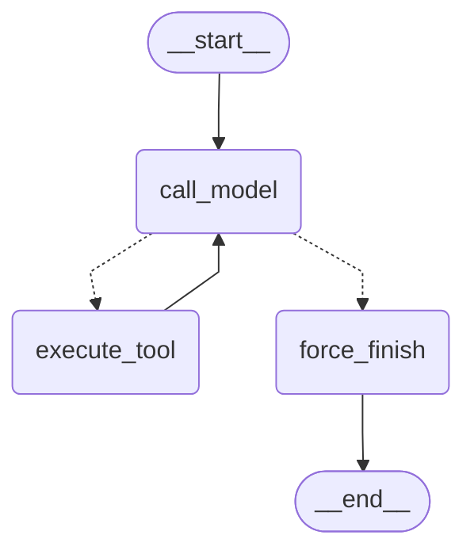

# Блок 6.3: LangGraph

## 1. Конфигурация

- Модель: `gpt-5.4-mini` через локальный LM Studio
  (`http://127.0.0.1:1235/v1`, ключ в отчёт не записывается).
- Temperature: `0`.
- Максимум итераций custom-графа: `6`.
- Timeout baseline ReAct: `15` секунд на итерацию; общий benchmark timeout:
  `60` секунд на один run.
- Tools: `search_knowledge_base`, `get_current_time`,
  `send_telegram_message`.
- Графы: custom `StateGraph` и prebuilt `langchain.agents.create_agent`.
- Baseline: `app.services.agent_react.run_react_with_reflection` из блока 6.2;
  его critic usage остаётся частью итогового usage.
- Матрица: 5 задач x 3 реализации x 3 повтора = 45 run.
- Версии: `langgraph 1.2.10`, `langchain 1.3.14`,
  `langchain-openai 1.4.1`, `openai 2.45.0`.

## 2. State contract

`AgentState` хранит три сериализуемых поля. `messages` использует reducer
`add_messages` и накапливает историю с протокольным слиянием. `iteration_count`
заменяется новым числом после каждого actor-вызова. `tool_results` использует
`operator.add` и накапливает нормализованные результаты инструментов. SDK-клиент,
ключи, URL, HTTP-сессии и логгер в state не входят.

| Поле | Тип | Reducer | Назначение |
|---|---|---|---|
| `messages` | `list[AnyMessage]` | `add_messages` | История model/tool protocol |
| `iteration_count` | `int` | замена | Число model calls custom-графа |
| `tool_results` | `list[dict]` | `operator.add` | Нормализованная трасса tools |

## 3. Router и остановка

`route_after_model` является чистой функцией. При `iteration_count >= 6` она
направляет выполнение в `force_finish`; иначе tool calls ведут в `execute_tool`,
а обычный финальный ответ — в `force_finish`. При остановке с незавершёнными
tool calls узел создаёт соответствующий `ToolMessage` для каждого call ID и
только затем финальное сообщение `Превышен лимит итераций`, сохраняя валидный
Chat Completions protocol.

`execute_tool` использует только явный `TOOLS_BY_NAME`. Неизвестный tool,
невалидные аргументы и исключение реализации превращаются в связанный
`ToolMessage(status="error")`, после чего граф может продолжить цикл. При
обычном ответе без tool calls `force_finish` сохраняет ответ и завершает граф.

## 4. Mermaid-схема custom graph

Полные автоматически сгенерированные схемы находятся в
`docs/agent-graph-custom.mmd` и `docs/agent-graph-prebuilt.mmd`.

## 5. Benchmark

Первичный монолитный benchmark перегрузил компьютер и дал 21 технически
неуспешный результат. Без удаления исходных attempt 1 были выполнены безопасные
последовательные attempt 2. Финальная каноническая матрица содержит 45 записей:
40 технически успешных, 5 timeout, 0 других ошибок и 18 `correct=true`.
Повторы для пяти timeout исчерпали `max_attempts=2`.

Runner поддерживает безопасное продолжение через `--resume`, фильтры задачи,
реализации и повтора, а также `--aggregate-only` без обращения к LLM. Единый
источник формулировок — `app/eval/agent_scenarios.py`. Каждый запуск имеет
идентификатор `bench-{task_id}-{implementation}-{repeat}` и отдельный raw JSON.

`total_steps` для всех реализаций означает количество `AIMessage`, то есть
model invocations в нормальной траектории. Usage суммируется только по уникальным
`AIMessage`: `input/prompt` нормализуется в `prompt_tokens`, `output/completion`
— в `completion_tokens`, а `total_tokens` берётся из metadata либо вычисляется
как сумма. `ToolMessage` токены не добавляет, две metadata одного сообщения не
суммируются повторно.

Каждый запуск ограничен `asyncio.wait_for` общим лимитом 60 секунд. Для
custom/prebuilt отменяется async-вызов; baseline дополнительно получает 15
секунд на ReAct-итерацию. Python
не умеет принудительно завершать уже работающий `to_thread`, поэтому per-run
timeout baseline честно записывается сразу, а его внутренний поток остаётся
ограничен собственными timeout/лимитом итераций. Hard-kill не заявляется.
Полный benchmark CLI дополнительно отказывается работать с нелокальным base URL,
чтобы случайно не отправить 45 запусков во внешний или платный endpoint.

<!-- BENCHMARK_RESULTS_START -->
Сохранено основных raw: 45/45. Первично неуспешных: 21; восстановлено повторными попытками: 16; осталось неуспешных: 5. Итоговая агрегация завершена.

### Основные запуски

| Задача | Реализация | Repeat | Latency ms | Prompt tokens | Completion tokens | Total tokens | Steps | Tool calls | Корректно | Ошибка |
|---:|---|---:|---:|---:|---:|---:|---:|---:|---|---|
| 1 | custom | 1 | 19751.38 | 1524 | 551 | 2075 | 2 | 1 | None | — |
| 1 | custom | 2 | 10138.08 | 1524 | 551 | 2075 | 2 | 1 | None | — |
| 1 | custom | 3 | 13366.36 | 1524 | 551 | 2075 | 2 | 1 | None | — |
| 1 | prebuilt | 1 | 13883.1 | 1524 | 551 | 2075 | 2 | 1 | None | — |
| 1 | prebuilt | 2 | 14053.94 | 1524 | 551 | 2075 | 2 | 1 | None | — |
| 1 | prebuilt | 3 | 13661.73 | 1524 | 551 | 2075 | 2 | 1 | None | — |
| 1 | react_6_2 | 1 | 15018.23 | 741 | 172 | 913 | 1 | 0 | False | Timeout |
| 1 | react_6_2 | 2 | 15015.7 | 741 | 151 | 892 | 1 | 0 | False | Timeout |
| 1 | react_6_2 | 3 | 60005.12 | 0 | 0 | 0 | 0 | 0 | False | Per-run timeout after 60 sec |
| 2 | custom | 1 | 7134.23 | 1461 | 262 | 1723 | 2 | 1 | True | — |
| 2 | custom | 2 | 7140.54 | 1461 | 281 | 1742 | 2 | 1 | True | — |
| 2 | custom | 3 | 41442.69 | 1461 | 7516 | 8977 | 3 | 1 | True | — |
| 2 | prebuilt | 1 | 2008.99 | 1461 | 263 | 1724 | 2 | 1 | True | — |
| 2 | prebuilt | 2 | 5510.23 | 1461 | 226 | 1687 | 2 | 1 | True | — |
| 2 | prebuilt | 3 | 6895.63 | 1461 | 262 | 1723 | 2 | 1 | True | — |
| 2 | react_6_2 | 1 | 17313.52 | 1711 | 662 | 2373 | 2 | 1 | True | — |
| 2 | react_6_2 | 2 | 14066.03 | 1711 | 679 | 2390 | 2 | 1 | True | — |
| 2 | react_6_2 | 3 | 14369.12 | 1711 | 1145 | 2856 | 2 | 1 | True | — |
| 3 | custom | 1 | 23558.27 | 1562 | 516 | 2078 | 2 | 1 | None | — |
| 3 | custom | 2 | 13535.24 | 1562 | 516 | 2078 | 2 | 1 | None | — |
| 3 | custom | 3 | 13787.11 | 1562 | 516 | 2078 | 2 | 1 | None | — |
| 3 | prebuilt | 1 | 13639.62 | 1562 | 516 | 2078 | 2 | 1 | None | — |
| 3 | prebuilt | 2 | 10278.54 | 1562 | 516 | 2078 | 2 | 1 | None | — |
| 3 | prebuilt | 3 | 13127.46 | 1562 | 516 | 2078 | 2 | 1 | None | — |
| 3 | react_6_2 | 1 | 17150.24 | 1920 | 2026 | 3946 | 2 | 1 | None | — |
| 3 | react_6_2 | 2 | 15020.38 | 760 | 174 | 934 | 1 | 0 | False | Timeout |
| 3 | react_6_2 | 3 | 15023.74 | 760 | 300 | 1060 | 1 | 0 | False | Timeout |
| 4 | custom | 1 | 11262.23 | 2496 | 893 | 3389 | 3 | 2 | False | — |
| 4 | custom | 2 | 7147.78 | 2496 | 893 | 3389 | 3 | 2 | False | — |
| 4 | custom | 3 | 7165.13 | 2496 | 893 | 3389 | 3 | 2 | False | — |
| 4 | prebuilt | 1 | 10957.0 | 2496 | 893 | 3389 | 3 | 2 | False | — |
| 4 | prebuilt | 2 | 7141.52 | 2496 | 893 | 3389 | 3 | 2 | False | — |
| 4 | prebuilt | 3 | 7145.49 | 2496 | 893 | 3389 | 3 | 2 | False | — |
| 4 | react_6_2 | 1 | 30485.3 | 3545 | 2703 | 6248 | 3 | 2 | None | — |
| 4 | react_6_2 | 2 | 25697.11 | 3419 | 3394 | 6813 | 3 | 2 | None | — |
| 4 | react_6_2 | 3 | 28612.44 | 4637 | 4149 | 8786 | 4 | 3 | None | — |
| 5 | custom | 1 | 3697.78 | 698 | 650 | 1348 | 1 | 0 | True | — |
| 5 | custom | 2 | 3373.27 | 698 | 650 | 1348 | 1 | 0 | True | — |
| 5 | custom | 3 | 3379.53 | 698 | 650 | 1348 | 1 | 0 | True | — |
| 5 | prebuilt | 1 | 3516.87 | 698 | 650 | 1348 | 1 | 0 | True | — |
| 5 | prebuilt | 2 | 3376.26 | 698 | 650 | 1348 | 1 | 0 | True | — |
| 5 | prebuilt | 3 | 3372.69 | 698 | 650 | 1348 | 1 | 0 | True | — |
| 5 | react_6_2 | 1 | 2340.72 | 734 | 405 | 1139 | 1 | 0 | True | — |
| 5 | react_6_2 | 2 | 1533.19 | 734 | 286 | 1020 | 1 | 0 | True | — |
| 5 | react_6_2 | 3 | 3416.99 | 734 | 657 | 1391 | 1 | 0 | True | — |

### Агрегация

| Задача | Реализация | Avg latency ms | Min | Max | Avg prompt | Avg completion | Avg total tokens | Avg steps | Avg tool calls | Успешно | Корректно | Timeout | Другие ошибки |
|---:|---|---:|---:|---:|---:|---:|---:|---:|---:|---:|---:|---:|---:|
| 1 | custom | 14418.61 | 10138.08 | 19751.38 | 1524.0 | 551.0 | 2075.0 | 2.0 | 1.0 | 3 | 0 | 0 | 0 |
| 1 | prebuilt | 13866.26 | 13661.73 | 14053.94 | 1524.0 | 551.0 | 2075.0 | 2.0 | 1.0 | 3 | 0 | 0 | 0 |
| 1 | react_6_2 | — | — | — | — | — | — | — | — | 0 | 0 | 3 | 0 |
| 2 | custom | 18572.49 | 7134.23 | 41442.69 | 1461.0 | 2686.33 | 4147.33 | 2.33 | 1.0 | 3 | 3 | 0 | 0 |
| 2 | prebuilt | 4804.95 | 2008.99 | 6895.63 | 1461.0 | 250.33 | 1711.33 | 2.0 | 1.0 | 3 | 3 | 0 | 0 |
| 2 | react_6_2 | 15249.56 | 14066.03 | 17313.52 | 1711.0 | 828.67 | 2539.67 | 2.0 | 1.0 | 3 | 3 | 0 | 0 |
| 3 | custom | 16960.21 | 13535.24 | 23558.27 | 1562.0 | 516.0 | 2078.0 | 2.0 | 1.0 | 3 | 0 | 0 | 0 |
| 3 | prebuilt | 12348.54 | 10278.54 | 13639.62 | 1562.0 | 516.0 | 2078.0 | 2.0 | 1.0 | 3 | 0 | 0 | 0 |
| 3 | react_6_2 | 17150.24 | 17150.24 | 17150.24 | 1920.0 | 2026.0 | 3946.0 | 2.0 | 1.0 | 1 | 0 | 2 | 0 |
| 4 | custom | 8525.05 | 7147.78 | 11262.23 | 2496.0 | 893.0 | 3389.0 | 3.0 | 2.0 | 3 | 0 | 0 | 0 |
| 4 | prebuilt | 8414.67 | 7141.52 | 10957.0 | 2496.0 | 893.0 | 3389.0 | 3.0 | 2.0 | 3 | 0 | 0 | 0 |
| 4 | react_6_2 | 28264.95 | 25697.11 | 30485.3 | 3867.0 | 3415.33 | 7282.33 | 3.33 | 2.33 | 3 | 0 | 0 | 0 |
| 5 | custom | 3483.53 | 3373.27 | 3697.78 | 698.0 | 650.0 | 1348.0 | 1.0 | 0.0 | 3 | 3 | 0 | 0 |
| 5 | prebuilt | 3421.94 | 3372.69 | 3516.87 | 698.0 | 650.0 | 1348.0 | 1.0 | 0.0 | 3 | 3 | 0 | 0 |
| 5 | react_6_2 | 2430.3 | 1533.19 | 3416.99 | 734.0 | 449.33 | 1183.33 | 1.0 | 0.0 | 3 | 3 | 0 | 0 |

### Общие средние по реализациям

| Реализация | Avg latency ms | Avg prompt | Avg completion | Avg total tokens | Avg steps | Avg tool calls | Success rate | Correctness rate | Timeout |
|---|---:|---:|---:|---:|---:|---:|---:|---:|---:|
| react_6_2 | 15498.47 | 2085.6 | 1610.6 | 3696.2 | 2.1 | 1.1 | 66.67% | 40.0% | 5 |
| custom | 12391.97 | 1548.2 | 1059.27 | 2607.47 | 2.07 | 1.0 | 100.0% | 40.0% | 0 |
| prebuilt | 8571.27 | 1548.2 | 572.07 | 2120.27 | 2.0 | 1.0 | 100.0% | 40.0% | 0 |
<!-- BENCHMARK_RESULTS_END -->

## 6. Custom и prebuilt

Средние считаются только по технически успешным runs. Prebuilt оказался самым
быстрым (`8571.27 ms`) и использовал меньше всего токенов (`2120.27`). Custom
занял второе место (`12391.97 ms`, `2607.47` tokens). Оба LangGraph-варианта
завершили 15/15 runs без timeout и имели одинаковые общие средние по tools
(`1.0`). Prebuilt требует меньше orchestration-кода и быстрее даёт стандартный
model-tools цикл; custom явно контролирует state, reducers, router, ошибки tools
и закрытие незавершённых `tool_call_id`.

ReAct был медленнее (`15498.47 ms`) и дороже (`3696.2` tokens по успешным
runs), а success rate составил `66.67%`. Critic добавлял отдельные model calls и
usage. На пяти финальных runs он не уложился в 15 секунд; эти timeout являются
измеренным поведением baseline, а не ошибкой отчёта.

По качеству простого детерминированного ответа различий нет: все реализации
успешно решили задачи 2 и 5. Значение correctness rate `40%` означает 6
`correct=true` из 15 на реализацию; задачи с `correct=None` требуют ручной
проверки и не считаются True. На задаче 4 custom и prebuilt сделали по два
поисковых tool call, но не вызвали `send_telegram_message`, хотя подтверждение
было дано, поэтому получили `correct=false`. ReAct вызвал поиск и print-заглушку
отправки, но потребовал больше шагов и токенов. Ручной router custom дал больше
контроля над протоколом и остановкой, но сам по себе не улучшил решение модели.

## 7. Реальные баги отладки

1. Standalone `visualize_graph.py` не видел пакет `app`; добавлен вычисляемый
   `PROJECT_ROOT` в `sys.path`.
2. Benchmark передавал ReAct timeout `30`, хотя публичный диапазон блока 6.2 —
   `5..15`; react timeout отделён от общего run timeout.
3. Массовый процесс перегрузил память; добавлены `--resume`, фильтры,
   последовательные пачки, немедленная запись raw и `gc.collect()`.
4. LM Studio выгрузил модель, что честно сохранилось как `No models loaded`;
   успешные attempt 2 не перезаписали исходные ошибки.
5. Общий timeout 60 секунд мог завершить runner раньше фонового ReAct thread;
   поздний результат не подменял уже сохранённый raw.
6. Critic ReAct не уложился в 15 секунд на пяти финальных runs: три для задачи 1
   и два для задачи 3.

## 8. Переход к checkpointing

Wrappers уже принимают `thread_id` и передают его через
`configurable.thread_id`, но без checkpointer это только совместимый интерфейс,
а не память между вызовами. Для персистентности нужно скомпилировать custom-граф
с `AsyncSqliteSaver` или `AsyncPostgresSaver` и задать политику хранения. State
уже не содержит несериализуемых клиентов, поэтому менять его контракт не нужно.

## 9. Итоговые наблюдения

- Prebuilt дал лучшую среднюю latency и token usage на этой локальной выборке.
- Custom обеспечил наиболее явный контроль переходов, но был медленнее prebuilt.
- Оба LangGraph-варианта стабильнее baseline по техническому success rate.
- Critic увеличил стоимость ReAct и стал причиной пяти финальных timeout.
- Для подтверждённого пишущего действия LangGraph-модели недовызвали нужный tool;
  контроль графа не заменяет качество решения LLM.
- Attempts и timeout сохранены как часть эксперимента; синтетических метрик и
  подмены неуспешных результатов нет.
