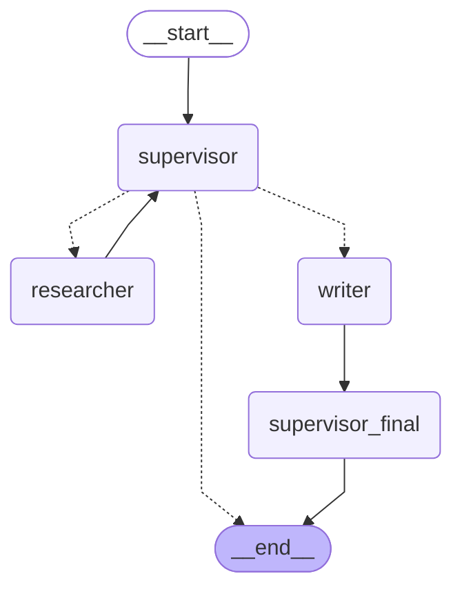

# Архитектура multi-agent эксперимента

Схема получена из скомпилированного LangGraph через
`app.get_graph().draw_mermaid()`. Supervisor маршрутизирует запрос к researcher
с RAG-инструментом, затем к writer без инструментов. Post-model guard сохраняет
решение supervisor, если тот вызвал `transfer_to_writer`, и детерминированно
направляет успешный результат researcher в writer только при некорректном stop.
После writer узел `supervisor_final` завершает граф без дополнительного
LLM-синтеза.

