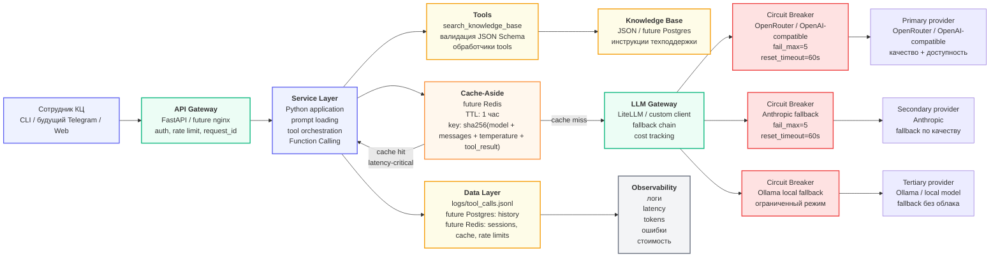

# Архитектурный паспорт проекта

## Проект

**Название:** ИИ-ассистент техподдержки сотрудников контактного центра.

**Назначение:** ассистент помогает сотрудникам получать инструкции по типовым вопросам: восстановление доступов, VPN, CRM, корпоративная почта, рабочее место, ошибки в системах и создание обращений в техподдержку.

Текущая версия проекта уже содержит базовый LLM-клиент, prompt-файлы, Function Calling и инструмент `search_knowledge_base`, который ищет инструкции во внутренней базе знаний.

---

## 1. Целевая архитектура

Архитектура строится по четырём слоям:

1. **Gateway** — принимает запросы пользователя, отвечает за auth, rate limit и маршрутизацию.
2. **Service** — бизнес-логика ассистента: подготовка промпта, вызов инструментов, обработка ответа.
3. **LLM** — слой работы с LLM-провайдерами, fallback chain и circuit breaker.
4. **Data** — база знаний, история обращений, кеш, логи и метрики.



---

## 2. Поток одного запроса

1. Сотрудник контактного центра отправляет вопрос ассистенту.
2. Gateway принимает запрос, проверяет ограничения по частоте и добавляет `request_id`.
3. Service Layer загружает system prompt и историю диалога.
4. LLM определяет, можно ли ответить сразу или нужен вызов инструмента.
5. Если нужен инструмент, вызывается `search_knowledge_base`.
6. Результат инструмента возвращается в LLM.
7. Перед финальным LLM-вызовом проверяется Cache-Aside.
8. При cache hit сервис возвращает сохранённый ответ.
9. При cache miss запрос уходит в LLM Gateway.
10. LLM Gateway отправляет запрос primary-провайдеру.
11. Если primary недоступен, срабатывает Circuit Breaker и fallback chain.
12. Ответ возвращается пользователю и логируется.

---

## 3. Нагрузка и ограничения

Оценка для MVP-версии дипломного проекта:

| Параметр | Значение |
|---|---:|
| Средняя нагрузка | 20 RPM |
| Пиковая нагрузка | 100 RPM |
| Средний размер ответа | 300–500 токенов |
| Средний входной контекст | 1000–2000 токенов |
| Оценочный TPM в пике | 150 000–250 000 TPM |
| Целевой latency для короткого ответа | 2–6 секунд |
| Целевой cache hit rate | 30–40% |
| Бюджет на LLM для MVP | до $1–3 в день |

### Latency-critical вызовы

К ним относятся интерактивные ответы сотруднику:

- вопрос по VPN;
- восстановление доступа;
- ошибка CRM;
- уточнение по рабочему месту;
- поиск инструкции в базе знаний.

Для таких запросов важнее скорость ответа, поэтому используется короткий контекст, кеш и fallback на более дешёвую/быструю модель.

### Cost-critical вызовы

К ним относятся будущие фоновые задачи:

- анализ логов обращений;
- классификация большого количества запросов;
- суммаризация истории по сотруднику;
- подготовка отчётов по типовым проблемам.

Для таких задач можно использовать Queue-based обработку, batch API и дешёвые модели.

---

## 4. ADR-001: выбор паттерна взаимодействия

**Status:** Accepted  
**Date:** 2026-05-31

### Context

Проект — ИИ-ассистент техподдержки для сотрудников контактного центра. Основной сценарий — интерактивный вопрос-ответ: сотрудник задаёт вопрос по доступам, VPN, CRM, почте или рабочему месту, а ассистент возвращает короткую инструкцию. В текущей версии уже реализован Function Calling: модель может вызвать инструмент `search_knowledge_base`, получить инструкцию из базы знаний и сформировать финальный ответ.

Ожидаемая нагрузка для MVP — около 20 RPM в среднем и до 100 RPM в пике. Средний ответ — 300–500 токенов, средний входной контекст — 1000–2000 токенов.

### Decision

Для основной версии выбран паттерн **Request-Response**.

Причина: текущий ассистент не генерирует длинные тексты и не требует потоковой печати ответа. Для сотрудника важнее получить короткую, цельную и проверяемую инструкцию, чем видеть генерацию по токенам. Request-Response проще в реализации, тестировании, логировании и обработке ошибок.

### Consequences

Плюсы:

- простая архитектура;
- легче логировать полный ответ;
- проще обрабатывать tool calls;
- проще добавить кеширование;
- меньше требований к Gateway и клиентскому интерфейсу.

Минусы:

- пользователь ждёт полный ответ целиком;
- при длинных генерациях UX будет хуже;
- при росте сценариев может понадобиться Streaming.

### Alternatives considered

**Streaming** отвергнут для текущего MVP, потому что ответы короткие, а интерфейс пока не требует token-by-token вывода.

**Queue-based** отвергнут для основного сценария, потому что сотруднику нужен ответ сразу, а не через polling или webhook.

**Fan-out / Fan-in** пока избыточен. Его можно добавить позже для параллельной проверки нескольких источников знаний или сравнения ответов разных моделей.

---

## 5. ADR-002: стратегия fault tolerance

**Status:** Accepted  
**Date:** 2026-05-31

### Context

LLM-провайдер может быть недоступен, отвечать медленно, возвращать 429/500/503 или превышать лимиты. Для ассистента техподдержки это критично: если LLM недоступна, сотрудник не получает инструкцию и вынужден искать ответ вручную.

### Decision

Выбрана многоуровневая стратегия отказоустойчивости:

1. **Timeout** на каждый LLM-вызов.
2. **Retry with exponential backoff** для временных ошибок.
3. **Circuit Breaker** отдельно на каждого провайдера.
4. **Fallback chain:** primary → secondary → local fallback.
5. **Cache-Aside** перед LLM-слоем.
6. **Graceful degradation** при полном отказе LLM.

Порядок провайдеров:

1. **Primary:** OpenRouter / OpenAI-compatible provider — основной провайдер для MVP.
2. **Secondary:** Anthropic — fallback по качеству.
3. **Tertiary:** Ollama / local model — ограниченный локальный режим, если облачные провайдеры недоступны.

Circuit Breaker настраивается отдельно для каждого провайдера: `fail_max=5`, `reset_timeout=60s`.

Cache-Aside: Redis, TTL 1 час, ключ `sha256(model + messages + temperature + tool_result)`.

### Consequences

Плюсы:

- отказ одного провайдера не ломает весь сервис;
- кеш снижает latency и стоимость;
- Circuit Breaker защищает workers от зависающих запросов;
- локальный fallback позволяет сохранить ограниченный UX даже без облачных LLM.

Минусы:

- усложняется конфигурация;
- нужно логировать, какой провайдер дал ответ;
- ответы fallback-моделей могут отличаться по качеству;
- потребуется наблюдаемость по ошибкам, latency, токенам и стоимости.

---

## 6. Потенциальные точки отказа

| Слой | Что может сломаться | Что произойдёт | Паттерн защиты | Graceful degradation |
|---|---|---|---|---|
| Gateway | Ошибка auth, rate limit, nginx/FastAPI недоступен | Пользователь не сможет отправить запрос | Healthcheck, rate limit, retry на клиенте | Показать сообщение о временной недоступности |
| Service | Ошибка в prompt loader, tool orchestration или JSON Schema | Ассистент не сможет корректно обработать запрос | Валидация схем, try/except, structured logs | Ответить шаблоном и предложить обратиться в техподдержку |
| Tools | `search_knowledge_base` не нашёл инструкцию или база знаний недоступна | Модель не получит нужный контекст | Fallback на уточняющий вопрос | Попросить уточнить систему, ошибку или тип доступа |
| LLM | Primary provider вернул 429/500/503 или timeout | Финальный ответ не сформируется | Timeout, retry, Circuit Breaker, Fallback chain | Перейти на secondary/local model или шаблонный ответ |
| Cache | Redis недоступен | Вырастет latency и стоимость | Cache-Aside с безопасным miss | Работать напрямую через LLM без кеша |
| Data | Логи или история не записались | Потеря наблюдаемости и части истории | Retry записи, локальный fallback log | Ответ пользователю всё равно возвращается |
| External provider | Все LLM-провайдеры недоступны | Нет генерации ответа | Fallback chain + template fallback | Вернуть честное сообщение: «Сервис временно недоступен, попробуйте позже» |

---

## 7. Cache-Aside

Cache-Aside используется перед LLM-слоем.

Алгоритм:

1. Service формирует нормализованный ключ кеша.
2. Проверяет Redis.
3. Если ответ найден — возвращает его без LLM-вызова.
4. Если ответа нет — вызывает LLM.
5. После успешного ответа сохраняет результат в кеш.

Параметры:

| Параметр | Значение |
|---|---|
| Хранилище | Redis |
| TTL | 1 час |
| Ключ | `sha256(model + messages + temperature + tool_result)` |
| Целевой cache hit rate | 30–40% |
| Что кешируем | Ответы при `temperature=0` или близкой к 0 |
| Что не кешируем | Персональные, устаревающие и неоднозначные ответы |

Кеш особенно полезен для повторяющихся вопросов:

- как восстановить VPN;
- что делать при ошибке CRM;
- как оформить заявку;
- как сбросить пароль;
- что делать, если не работает корпоративная почта.

---

## 8. Bulkhead и rate limiting

Для защиты от перегрузки планируется использовать отдельные лимиты на разные типы операций.

| Операция | Лимит | Причина |
|---|---:|---|
| Интерактивный вопрос сотрудника | 50 одновременных запросов | latency-critical сценарий |
| Tool call к базе знаний | 100 одновременных запросов | локальная операция дешевле LLM |
| LLM-вызов | 20 одновременных запросов | защита от 429 и лишних расходов |
| Batch-анализ логов | 5 одновременных задач | cost-critical сценарий |

На уровне Python это можно реализовать через `asyncio.Semaphore`.

---

## 9. LiteLLM как LLM Gateway

LiteLLM рассматривается как готовый LLM Gateway для проекта.

### Что даёт LiteLLM

- единый OpenAI-compatible API для разных провайдеров;
- fallback chain между моделями;
- routing по провайдерам;
- retry и timeout на уровне gateway;
- cost tracking;
- возможность менять провайдера через конфиг, а не через код.

### Решение

Для MVP можно оставить собственный LLM-клиент, потому что проект пока небольшой и уже использует OpenAI-compatible API.

Для следующего этапа целесообразно подключить **LiteLLM**, если появятся:

- несколько провайдеров;
- отдельные fallback-правила;
- централизованный cost tracking;
- A/B тестирование моделей;
- необходимость менять маршрутизацию без изменения кода.

### Пример запуска LiteLLM proxy

Конфиг лежит в:

```text
docs/litellm/config.yaml
```

Установка:

```bash
pip install "litellm[proxy]"
```

Запуск proxy:

```bash
litellm --config docs/litellm/config.yaml --port 4000
```

Пример запроса:

```bash
curl http://localhost:4000/v1/chat/completions ^
  -H "Content-Type: application/json" ^
  -H "Authorization: Bearer anything" ^
  -d "{\"model\":\"support-assistant-primary\",\"messages\":[{\"role\":\"user\",\"content\":\"Как восстановить доступ к VPN?\"}]}"
```

---

## 10. Что будет реализовано в следующих блоках

В следующих модулях архитектура будет развиваться:

- в FastAPI появится явное разделение Gateway и Service;
- LLM-клиент будет вынесен в отдельный слой;
- появится observability по latency, токенам, ошибкам и стоимости;
- к Service-слою можно будет подключить Telegram-бот;
- Data-слой можно будет расширить до RAG: embeddings, vector store и поиск по базе знаний.

---

## Итог

Для дипломного проекта выбрана простая и расширяемая архитектура:

- основной паттерн — **Request-Response**;
- LLM-вызовы защищены через **timeout, retry, Circuit Breaker и Fallback chain**;
- перед LLM-слоем предусмотрен **Cache-Aside**;
- состояние и данные постепенно выносятся во внешний Data Layer;
- LiteLLM рассматривается как будущий LLM Gateway для мультипровайдерности.

Такой подход подходит для MVP ИИ-ассистента техподдержки и оставляет пространство для дальнейшего развития: Telegram-бота, RAG, observability и production-ready fault tolerance.