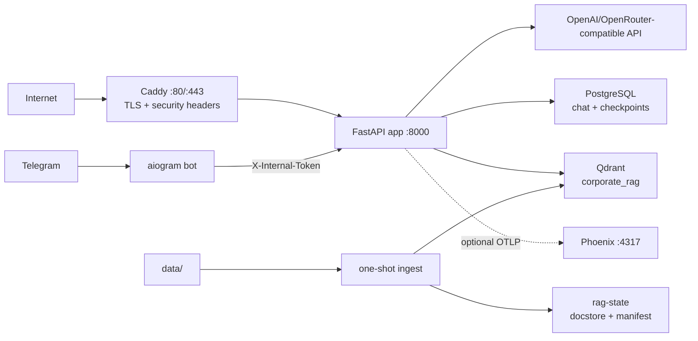

# Production architecture

Этот документ описывает фактический runtime ветки `final-diploma`. Исторический ADR с Redis/LiteLLM сохранён в [archive/architecture-course-design.md](archive/architecture-course-design.md).

## Runtime topology

```mermaid
flowchart LR
    Internet --> Caddy["Caddy :80/:443<br/>TLS + security headers"]
    Caddy --> App["FastAPI app :8000"]
    Telegram["Telegram"] --> Bot["aiogram bot"]
    Bot -->|"X-Internal-Token"| App

    App --> Provider["OpenAI/OpenRouter-compatible API"]
    App --> PG["PostgreSQL<br/>chat + checkpoints"]
    App --> Q["Qdrant<br/>corporate_rag"]
    App -. optional OTLP .-> Phoenix["Phoenix :4317"]

    Corpus["data/"] --> Ingest["one-shot ingest"]
    Ingest --> Q
    Ingest --> RagState["rag-state<br/>docstore + manifest"]
```

Base Compose содержит `app`, `bot`, `ingest`, `postgres`, `qdrant` и `phoenix`. Production overlay добавляет `config-check` и `proxy` (Caddy). Redis и LiteLLM отсутствуют.

## Startup and readiness

1. Postgres и Qdrant проходят healthchecks; Phoenix должен запуститься.
2. One-shot `ingest` выполняет incremental ingestion и завершается с code `0`.
3. `app` запускается только после успешного ingest.
4. App создаёт один PostgreSQL pool, OpenAI-compatible async client, bounded LLM cache, Qdrant/RAG resources, LangGraph graph/checkpointer и retention manager.
5. `bot` ждёт healthy app. Без реального `BOT_TOKEN` он завершается без restart loop.

`GET /health/live` проверяет только процесс. `GET /health/ready` без платного LLM-вызова проверяет PostgreSQL, Qdrant и наличие `corporate_rag`.

## Request paths

### Public chat and RAG

`/chat` и `/chat/stream` применяют server-selected model и `CHAT_MAX_TOKENS`. `/rag/query` выполняет retrieval из `corporate_rag`, confidence guard и только затем generation. Empty retrieval — штатный ответ; инфраструктурная ошибка Qdrant — structured 503.

Public generation routes разделяют process-local hard budget. Rate limiting и concurrency middleware охватывают дорогие public endpoints; liveness/readiness не расходуют quota.

### Telegram

Bot не содержит собственной RAG/LLM-архитектуры. Он создаёт backend chat, отправляет text/media во внутренний `/chats/*` API, читает SSE, показывает sources и feedback. В public mode backend требует `X-Internal-Token`. Telegram end-user generation учитывается общим public generation budget.

### Persistent agent

Один compiled LangGraph graph переиспользуется весь lifespan приложения. Docker использует PostgreSQL checkpointer, локальный режим — SQLite. Public identity формируется сервером и изолирует namespace checkpoint. Public роль — только `read-only`; admin получает `write-with-approve`.

## Data and ownership

| Data | Store | Lifecycle |
| --- | --- | --- |
| Chat, messages, feedback, broadcasts | PostgreSQL в Compose; JSON локально | Configurable retention; активные chats защищены от cleanup |
| Agent checkpoints | PostgreSQL в Compose; SQLite локально | Configurable retention; активные threads защищены |
| Vectors | Qdrant `corporate_rag` | Incremental/full ingestion; backup snapshot |
| Ingestion manifest/docstore | `rag-state` volume | Persistent and included in backup |
| Embedding cache | host `.cache/embeddings` | Reusable generated cache, not diploma evidence |
| Traces | Phoenix volume | Production export disabled by default; historical pruning is operational |
| Logs | Docker json-file | Size/file rotation |

## Security boundaries

- Только Caddy публикуется наружу в production; app и data services остаются internal.
- `ADMIN_TOKEN` и `INTERNAL_TOKEN` защищают разные scopes.
- Public agent role/session identity, model и token limits контролируются сервером.
- CORS production allowlist принимает только явные HTTPS origins.
- Upload/reindex имеют auth, streaming size checks, MIME/signature/archive validation и общий ingestion lock.
- Public generation имеет rate, concurrency и hard request budget.
- Provider/Qdrant/internal exception text не включается в публичный JSON/SSE contract.

## Shutdown

App останавливает retention task, закрывает RAG/Qdrant clients, OpenAI-compatible client и PostgreSQL pool, затем flush/shutdown tracing. Docker restart policies и healthchecks описаны в [deployment.md](deployment.md).
