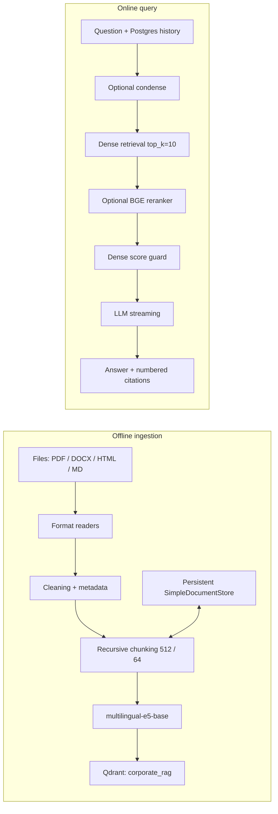

# Corporate RAG

## Architecture

Индексация и обработка пользовательского запроса являются независимыми
контурами:



`RAGService.build()` только подключает `QdrantVectorStore` к существующей
collection и создаёт retriever. Он не читает `data/`, не строит embeddings и
не запускает ingestion. Пустая или ещё не созданная collection даёт безопасный
fallback при запросе.

## Corpus

Ingestion root `data/` содержит 73 поддерживаемых документа: 25 Markdown, 16
HTML, 16 DOCX и 16 PDF. Это учебный предметный корпус внутренней техподдержки,
собранный из `data/support_kb.json`; подробная фактическая инвентаризация и
размеры находятся в [data_inventory.md](data_inventory.md).

`scripts/build_corporate_corpus.py` воспроизводимо строит 64 multi-format
документа. Старые артефакты Б5.2-Б5.4 не удаляются.

## Ingestion

`IngestionService` выполняет:

1. Рекурсивный поиск поддерживаемых файлов.
2. Явный выбор `PyMuPDFReader`, `DocxReader`, `HTMLTagReader` или
   `MarkdownReader`.
3. Безопасную нормализацию переносов и пустых строк.
4. Metadata enrichment: `source`, `source_path`, `file_name`, `category`,
   `doc_type`, `last_modified`, `version`, `author`, `language`.
5. Recursive chunking из `app/services/chunking.py`.
6. Нормализованные E5 embeddings и UPSERT в `corporate_rag`.
7. Сохранение `SimpleDocumentStore` и content manifest между процессами.

`source_path`, `last_modified`, `author`, `version` и `doc_type` исключены из
embedding metadata. Stable document ID равен SHA-256 нормализованного
относительного пути; для многостраничного документа к нему добавляется номер
части.

Runtime state хранится в `.cache/rag/docstore.json` и
`.cache/rag/docstore.manifest.json`, не коммитится и подключён к Docker volume
`rag-state`. Неизменный повторный запуск не парсит и не переэмбеддит документы.
Ошибка одного parser-а не останавливает batch: файл получает суффикс `.failed`,
а ошибка попадает в structured report.

## Query pipeline

| Parameter | Value |
| --- | --- |
| Collection | `corporate_rag` |
| Embedding | `intfloat/multilingual-e5-base` |
| Dimension / distance | 768 / COSINE |
| Chunking | recursive, 512 tokens, overlap 64 |
| Dense retrieval | top_k=10 |
| Reranker | disabled by default |
| Optional reranker | `BAAI/bge-reranker-v2-m3`, top_n=5 |
| Score threshold | `RAG_MIN_SCORE=0.82`, live recalibrated |
| Maximum shown sources | 5 |

Reranker остаётся выключенным по результатам Б5.4: на тестовом наборе качество
без него уже было `1.0 / 1.0 / 1.0`, а CPU latency выросла примерно на 1.3
секунды. При включении BGE меняет порядок top-10 candidates, но score guard
всегда сравнивает порог с исходным dense cosine score.

Если есть короткий follow-up и история, condense-вызов с temperature 0
переписывает только поисковый запрос. Generation получает исходный вопрос,
существующее окно Postgres history и retrieved context. При ошибке condense
используется исходный вопрос; второй memory store не создаётся.

## Score guard

Если retrieval пуст или максимальный dense score ниже `RAG_MIN_SCORE`, LLM не
вызывается. Контракт:

```json
{
  "answer": "По базе не нашёл, могу эскалировать.",
  "top_score": 0.0,
  "confident": false,
  "sources": []
}
```

Фактическая калибровка выполнена на Docker Qdrant после ingest 73 документов.
Вопросы были зафиксированы в `scripts/corporate_rag_smoke.py` до запуска:

| Group | Min score | Median | Max |
| --- | ---: | ---: | ---: |
| in-base | 0.850 | 0.864 | 0.879 |
| out-of-base | 0.761 | 0.796 | 0.809 |

Группы не пересекаются: максимум out-of-base `0.809` ниже минимума in-base
`0.850`. Поэтому сохраняется ранее откалиброванный E5 threshold `0.82`; он не
заменяется на методический `0.3`, относящийся к другому embedding setup.

## Citations and streaming

Retrieved context нумеруется `[1]`, `[2]`, ...; source contract содержит:
`id`, `file_name`, nullable `page`, dense `score`, `snippet` до 300 символов.
Некорректные citation IDs удаляются, а при отсутствии ссылки к confident
ответу добавляется `[1]`. При refusal источники не показываются.

ChatService использует RAG для text-only сообщений, но сохраняет существующий
multimodal flow для media. Provider stream собирается для output moderation,
после чего SSE отдаёт несколько `token` payload, отдельный `event: sources` и
`done` с `message_id`. Показанные sources сохраняются в JSON/JSONB поле
assistant message, поэтому существующий feedback остаётся привязан к ответу.

Telegram-бот не содержит RAG-логики. Он редактирует одно сообщение с debounce
0.8 секунды, добавляет до пяти имён файлов и feedback-кнопки, соблюдая лимит
4096 символов.

## Endpoints

| Endpoint | Purpose |
| --- | --- |
| `POST /rag/query` | Синхронный RAG contract |
| `POST /documents/upload` | 202 + background ingest одного файла |
| `POST /documents/reindex` | 202 + `full`, `incremental` или `files` |
| `POST /chats/{id}/messages` | RAG SSE для text-only chat |
| `POST /chats/{id}/messages/{message_id}/feedback` | Existing feedback |
| `POST /chats/{id}/handoff` | Existing operator handoff |

Upload принимает `.pdf`, `.docx`, `.html`, `.htm`, `.md`, отбрасывает path
traversal и валидирует category по `[A-Za-z0-9_-]+`. Full reindex очищает только
`corporate_rag` и её docstore, не затрагивая коллекции прошлых работ.

## Commands

```powershell
python scripts/build_corporate_corpus.py
python scripts/ingest.py data/
python scripts/ingest.py data/
python scripts/ingest.py data/ --mode full
docker compose --profile tools run --rm ingest
python -m uvicorn app.main:app --reload --port 8000
pytest -q
python -m compileall app bot scripts
docker compose config --quiet
docker compose up -d --build
```

## Live verification

Проверка выполнена 28 июля 2026 года на
`qdrant/qdrant:v1.18.0` в Docker:

| Check | Actual result |
| --- | --- |
| First `python scripts/ingest.py data/` | 73 changed, 0 unchanged, 0 failed, 73 nodes, 73 points, 12.0 s |
| Identical second ingest | 0 changed, 73 unchanged, 0 failed, 0 nodes, 73 points, 0.05 s |
| Isolated changed-file check | exactly 1 changed, points `1 -> 1`, smoke collection removed |
| In-base `/rag/query` | VPN, score 0.861, confident true, 5 sources, citations `[1]`-`[4]` |
| Out-of-base `/rag/query` | vacation, score 0.805, confident false, exact fallback, no sources, `generate_ms=0.0` |
| Multi-turn | follow-up condensed to `VPN не пускает после восстановления доступа`; 5 VPN sources |
| Chat SSE | 101 token events, then sources, then done with `message_id` |
| Postgres message | 5 shown sources and selected `prompt_id` persisted |
| Upload | HTTP 202; unique PDF was searchable after a 12-second wait and appeared as source `[1]` with score 0.849 |
| Docker | app/Postgres/Redis/Qdrant healthy; Phoenix and Telegram bot running |

Telegram token is valid and aiogram polling started. An interactive user message and
feedback-button click were not performed because no dedicated test recipient was
available; this path is covered by fake-bot tests. The local host port 8000 was
already occupied by another project, so live HTTP checks ran inside the compose
network; the app container healthcheck uses its own port 8000 and passed.

The image pins `torch==2.7.1+cpu` before installing the remaining requirements,
preventing a CUDA dependency download on the CPU runtime. The git-ignored host
`.cache/embeddings` directory is mounted into app and offline ingest so both
contours reuse the same model cache.
